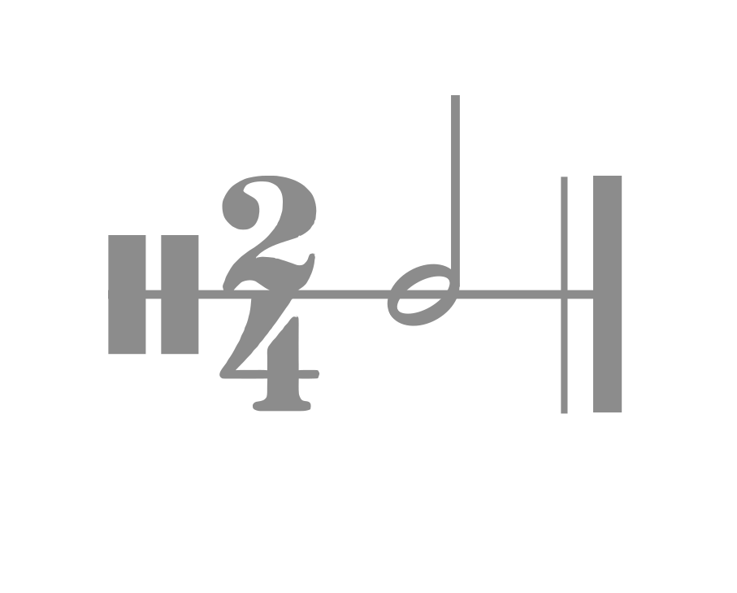

  

## Sound

Sound is a procedural interface sound kit with no audio files or dependencies.
Sounds are generated in the browser with the Web Audio API, and every playback
varies slightly through procedural noise so it feels less mechanical

### Skill

Use `$sound` when you want an agent to add the right sound presets to existing interactions

### Presets

- `press` — press
- `click` — click
- `tap` — primary action
- `hover` — hover
- `select` — selection
- `toggle` — state change
- `tick` — discrete step

